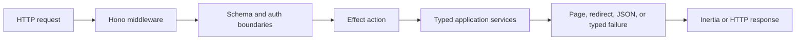

# @popcomputer/web

Effect-native, server-driven web applications on Hono.

`@popcomputer/web` combines the Inertia protocol, Hono routing, Effect programs,
typed request boundaries, optional Better Auth integration, and Drizzle route
model binding. It is designed for applications that want a Laravel-like
request-to-page workflow without giving up explicit dependencies and typed
failures.

```ts
export const showProject = action(
  Effect.gen(function* () {
    const project = yield* bound('project')
    yield* authorize((auth) => auth.user.id === project.userId)
    return yield* render('Projects/Show', { project })
  })
)
```

## Why this shape

- `setupWeb` is the single application composition boundary. It owns rendering,
  persistence, auth, schemas, middleware, and the shared error policy.
- Actions are ordinary Effect values. They declare only the services and
  failures they use, so small actions stay small and complex workflows compose.
- External data is parsed at the edge. Sessions, request input, route parameters,
  database rows, and cached values can all be checked with Effect Schema before
  application code relies on them.
- Route metadata belongs to a configured Hono app rather than global process
  state. CLI inspection therefore loads the app you explicitly select.
- The package keeps the standard Inertia wire protocol. Existing Inertia clients
  continue to use `X-Inertia`, partial reloads, asset versions, and redirects.

## Installation

```bash
bun add @popcomputer/web effect@4.0.0-rc.109 hono
```

Add only the optional integrations your application uses:

```bash
bun add better-auth                         # Better Auth integration
bun add drizzle-orm                         # Drizzle route model binding
bun add @inertiajs/react react react-dom    # React client
```

Effect and Hono are peer dependencies so an application owns one Effect runtime
and one Hono type identity. `better-auth` and `drizzle-orm` are optional peers.
The package supports Effect 4 (`4.0.0-rc.109`), Better Auth 1.x, and Hono 4
or newer.

### Upgrading from 0.4

`TestCaptureService.get` is now an Effect value. Replace
`yield* capture.get()` with `yield* capture.get` in custom test layers and helpers.

Numeric form values, numeric route bindings, and persisted cache timestamps
reject non-finite numbers. `nullableString` accepts scalar values and rejects
objects and arrays. `declined` now decodes `0`, `"0"`, `"false"`, `"no"`, and
`"off"` to `false`.

## Quick start

### 1. Describe application-owned types

Module augmentation connects the concrete clients and schemas created by your
application to the package's Effect services. These interfaces contain types,
not runtime configuration.

```ts
// src/web-types.ts
import type { createAuth } from './auth'
import type { createDb } from './db'
import type * as schema from './schema'

export type Bindings = {
  DATABASE_URL: string
  BETTER_AUTH_SECRET: string
  KV: KVNamespace
}

declare module '@popcomputer/web/effect' {
  interface WebBindingsType {
    type: Bindings
  }

  interface WebDatabaseType {
    type: ReturnType<typeof createDb>
    schema: typeof schema
  }

  interface WebAuthType {
    type: ReturnType<typeof createAuth>
  }
}
```

This gives `BindingsService`, `DatabaseService`, and `AuthService` their
application-specific types without passing generic parameters through every
action.

### 2. Configure the application once

```ts
// src/app.ts
import { Hono } from 'hono'
import { Schema as S } from 'effect'
import {
  createTemplate,
  createVersion,
  setupWeb,
} from '@popcomputer/web'
import { createAuth } from './auth'
import { createDb } from './db'
import manifest from '../dist/manifest.json'
import * as schema from './schema'
import type { Bindings } from './web-types'

type Env = { Bindings: Bindings }

const Project = S.Struct({
  id: S.String,
  name: S.String,
  userId: S.String,
})

const routeBindings = { project: Project }

declare module '@popcomputer/web/effect' {
  interface WebRouteBindingsType {
    type: typeof routeBindings
  }
}

const AuthSession = S.Struct({
  user: S.Struct({
    id: S.String,
    email: S.String,
    name: S.NullOr(S.String),
    emailVerified: S.Boolean,
    image: S.NullOr(S.String),
    createdAt: S.Date,
    updatedAt: S.Date,
  }),
  session: S.Struct({
    id: S.String,
    userId: S.String,
    expiresAt: S.Date,
    token: S.String,
    createdAt: S.Date,
    updatedAt: S.Date,
  }),
})

const app = new Hono<Env>()

const application = setupWeb(app, {
  version: createVersion(manifest),
  render: createTemplate({
    title: 'Projects',
    scripts: [manifest['src/main.tsx']?.file].filter(Boolean),
    styles: manifest['src/main.tsx']?.css ?? [],
  }),
  database: (c) => createDb(c.env.DATABASE_URL),
  schema,
  bindings: routeBindings,
  auth: {
    client: (c, { db, backgroundTasks }) => createAuth({
      db,
      secret: c.env.BETTER_AUTH_SECRET,
      baseURL: new URL(c.req.url).origin,
      advanced: { backgroundTasks },
    }),
    session: AuthSession,
    share: ({ user }) => ({
      id: user.id,
      name: user.name,
      image: user.image,
    }),
  },
  errors: { component: 'Error' },
})

export { application }
export default app
```

The configuration is deliberately flat. `setupWeb({ web: { ... } })` would
repeat the framework boundary without clarifying ownership.

Database-backed auth receives the database as an explicit dependency. The
following examples are alternative configurations; choose the shape that
matches the application. None require placeholders or explicit generics.

```ts
// Public application
setupWeb(app, { version, render })

// Database without auth
setupWeb(app, { version, render, database: (c) => createDb(c.env.DB) })

// Stateless auth
setupWeb(app, {
  version,
  render,
  auth: {
    client: (c, { backgroundTasks }) => createStatelessAuth({
      secret: c.env.AUTH_SECRET,
      advanced: { backgroundTasks },
    }),
  },
})
```

The `backgroundTasks` object has Better Auth's
`advanced.backgroundTasks` shape. Passing it through makes session refreshes,
email callbacks, and plugin work part of the request lifecycle: Workers use
`waitUntil`, while local and test runtimes finish the work before teardown.

For application code that calls Better Auth from Effect, wrap the concrete
instance once and keep plugin-added endpoint types:

```ts
import { effectifyBetterAuth } from '@popcomputer/web/auth'

const authEffect = effectifyBetterAuth(auth)
const session = yield* authEffect.api.getSession({ headers })
```

The raw Better Auth instance remains available as `authEffect.raw`. Expected
API failures stay typed in Effect, including cookies Better Auth attached while
processing a rejected request. Better Auth's conditional return-mode overloads
can lose precision when mirrored through the Effect mapped type; use
`authEffect.raw.api` when TypeScript does not retain an `asResponse`,
`returnHeaders`, or `returnStatus` result precisely.

Passing the app installs the middleware stack and shared error boundary and
returns `{ app, routes }`. The middleware-only form remains available for
manual Hono composition:

```ts
app.use('*', setupWeb({ version, render }))
```

### 3. Write actions and register routes

```ts
// src/actions/projects/show.ts
import { Effect } from 'effect'
import {
  action,
  authorize,
  bound,
  render,
} from '@popcomputer/web/effect'

export const showProject = action(
  Effect.gen(function* () {
    const project = yield* bound('project')
    yield* authorize((auth) => auth.user.id === project.userId)

    return yield* render('Projects/Show', { project })
  })
)
```

```ts
// src/routes.ts
import { effectRoutes } from '@popcomputer/web/effect'
import { showProject } from './actions/projects/show'

effectRoutes(app).get('/projects/{project}', showProject, {
  name: 'projects.show',
})
```

`action` does not hide another execution model. It preserves the Effect's
success, error, and requirement channels, while documenting that the program is
an HTTP action.

## Data flow



`setupWeb` builds the request-scoped Effect runtime and provides only the
services configured for that request. A missing database or auth service is
reported as a configuration error rather than being silently replaced with an
untyped value.

## Validation and safe writes

```ts
import { Effect, Schema as S } from 'effect'
import {
  action,
  asTrusted,
  authorize,
  DatabaseService,
  dbMutation,
  redirect,
  requiredString,
  validateRequest,
} from '@popcomputer/web/effect'
import { projects } from '../schema'

const CreateProject = S.Struct({
  name: requiredString,
  description: S.optional(S.String),
})

export const createProject = action(
  Effect.gen(function* () {
    const auth = yield* authorize()
    const input = yield* validateRequest(CreateProject, {
      errorComponent: 'Projects/Create',
    })
    const db = yield* DatabaseService

    const values = asTrusted({
      ...input,
      userId: auth.user.id,
    })

    yield* dbMutation(db, values, (tx, values) =>
      tx.insert(projects).values(values)
    )

    return yield* redirect('/projects')
  })
)
```

`validateRequest` returns branded validated data. `dbMutation` and
`dbTransaction` accept validated or explicitly trusted mutation inputs, making
the point where application-owned data becomes safe to write visible in code.
Database failures remain typed Effect failures.

## Route model binding

Register an Effect Schema once, then use Laravel-style route placeholders:

```ts
effectRoutes(app)
  .get('/projects/{project}', showProject)
  .get('/projects/{project:slug}', showProjectBySlug)
  .get('/projects/{project}/tasks/{task}', showTask)
```

Inside `showTask`, both models from the nested route are available by name:

```ts
const project = yield* bound('project')
const task = yield* bound('task')
```

The package parses route parameters and database rows before exposing them.
Nested bindings must have a relationship discoverable from Drizzle metadata or
an explicit scope:

```ts
const routeBindings = {
  task: routeBinding(Task, {
    scope: {
      project: { foreignKey: 'projectId' },
    },
  }),
}
```

This fails closed when a child lookup cannot be safely scoped to its parent.
Route model binding is currently Drizzle-specific even though the basic
`DatabaseService` can hold any application database client.

## Auth

The Better Auth helpers cover session loading, authenticated and guest routes,
form actions, logout, and public user projection.

`authorize()` can be called in two ways. Use it without a predicate when the
route only requires a signed-in user:

```ts
const auth = yield* authorize()
```

Pass a predicate when the route has an additional authorization rule. The
helper still returns the parsed `{ user, session }` value when the predicate
succeeds:

```ts
const auth = yield* authorize(
  ({ user }) => user.role === 'admin'
)
```

If there is no signed-in user, both forms fail with `UnauthorizedError`. If the
predicate returns `false`, the second form fails with `ForbiddenError`.

In the `setupWeb` auth configuration, use `auth.session` to parse the server
session; do not trust a dependency response because it looks session-shaped.
Use `auth.share` to deliberately choose the fields serialized into page props.

For form endpoints, `betterAuthFormAction` maps validated Better Auth 4xx
responses into form errors while keeping rate limits and dependency failures as
separate typed errors.

## Responses and failures

Choose the helper that matches the current action branch. These are alternative
endings, not statements to run in sequence:

| Intent | Action ending |
|---|---|
| Render a page | `return yield* render('Dashboard', { stats })` |
| Redirect | `return yield* redirect('/login')` |
| Return JSON | `return yield* json({ projects })` |
| Return JSON when requested, otherwise render a page | `return yield* jsonOrRender('Projects/Index', { projects })` |
| Fail with `NotFoundError` | `return yield* notFound('Project', projectId)` |
| Fail with `ForbiddenError` | `return yield* forbidden('You cannot edit this project')` |

Typed failures, defects, Hono exceptions, and not-found responses share the
configured error boundary. Use `EffectErrorObserverService` as the integration
point for Sentry, PostHog, or another reporting system; observation does not
change the failure channel.

## Caching and background work

The data cache validates serialized values with Effect Schema:

```ts
import { Duration, Effect, Schema as S } from 'effect'
import { cache } from '@popcomputer/web/cache'

const projects = yield* cache(
  `users:${userId}:projects`,
  Effect.tryPromise(() => loadProjects(userId)),
  S.Array(ProjectSummary),
  {
    ttl: Duration.minutes(5),
    swr: Duration.minutes(1),
    version: true,
  }
)
```

With a `KV` binding, `CacheService` uses Cloudflare KV. Stale-while-revalidate
uses the request execution context when available and refreshes inline in local
environments without background execution.

For runtime-owned work that must outlive a response:

```ts
yield* background(sendAuditEvent(event))
```

The route cache option separately emits Workers Cache headers and tags. It does
not publicly cache authenticated, cookie-setting, partial, failed, or mutating
responses.

## Lower-level composition

Most applications should use `setupWeb`. The lower-level APIs are available
when another composition root owns part of the middleware stack:

```ts
import { web, webContext, webServices } from '@popcomputer/web'
import { effectBridge } from '@popcomputer/web/effect'

app.use('*', web({ version, render }))
app.use('*', webServices((c) => ({
  db: createDb(c.env.DB),
})))
app.use('*', effectBridge())

app.use('/admin/*', async (c, next) => {
  const { authUser } = webContext(c)
  if (!authUser) return c.redirect('/login')
  await next()
})
```

Plain Hono handlers can render through `c.var.web`:

```ts
app.get('/', (c) => c.var.web.render('Home'))
```

Effect actions normally use the higher-level `render` helper. The underlying
service is available as `PageService` when direct composition is useful.

## CLI

The package exposes the `popweb` binary:

```bash
bunx @popcomputer/web routes --app src/app.ts --json
bunx @popcomputer/web check --app src/app.ts --verbose
bunx @popcomputer/web generate:action projects/create --method POST --path /projects
bunx @popcomputer/web generate:crud projects
bunx @popcomputer/web generate:feature projects/archive --method POST
bunx @popcomputer/web generate:openapi --app src/app.ts --output openapi.json
bunx @popcomputer/web db status
bunx @popcomputer/web db:migrate --preview
```

Installed projects may call `popweb` directly from package scripts. Commands
that inspect routes load the module passed with `--app`; it may export the Hono
app, the `{ app, routes }` result from `setupWeb`, or a `RouteRegistry`.

Migration state is written beside Drizzle migrations as
`.popweb-applied.json`. The CLI also reads the former
`.honertia-applied.json` filename so a package rename never causes an applied
migration to run again.

## Version values

Three different versions may appear around an application:

| Value | Meaning | Change it when | Effect of changing it |
|---|---|---|---|
| npm package version | Version of `@popcomputer/web` | You upgrade the dependency | Selects framework code and public API |
| `setupWeb({ version })` | Inertia asset version | Client assets or their manifest change | The next mismatched GET receives an Inertia location response and reloads the current assets |
| cache `version` | Namespace for one cached value shape | The cached schema or interpretation changes | Reads and writes use a fresh cache key |

`createVersion(manifest)` derives the Inertia asset version from manifest asset
paths. It is unrelated to the npm package version.

## Migrating from `honertia`

The rebrand is a package/API migration; the Inertia protocol does not change.

```diff
- import { setupHonertia } from 'honertia'
- import { action, render } from 'honertia/effect'
+ import { setupWeb } from '@popcomputer/web'
+ import { action, render } from '@popcomputer/web/effect'
```

Setup is flatter:

```diff
- setupHonertia(app, {
-   honertia: {
-     version,
-     render,
-     database,
-     schema,
-     bindings,
-   },
+ setupWeb(app, {
+   version,
+   render,
+   database,
+   schema,
+   bindings,
    auth,
  })
```

Public type and runtime names have direct replacements:

| Former name | Current name |
|---|---|
| `HonertiaDatabaseType` | `WebDatabaseType` |
| `HonertiaAuthType` | `WebAuthType` |
| `HonertiaBindingsType` | `WebBindingsType` |
| `HonertiaAuthUserType` | `WebAuthUserType` |
| `HonertiaRouteBindingsType` | `WebRouteBindingsType` |
| `HonertiaService` / `HonertiaRenderer` | `PageService` / `PageRenderer` |
| `honertiaContext` / `honertiaServices` | `webContext` / `webServices` |
| `honertia` middleware / `c.var.honertia` | `web` / `c.var.web` |
| `honertia` CLI | `popweb` CLI |

Deprecated aliases remain in `@popcomputer/web@0.3` to support an incremental
source migration. New code should use the current names. The old `honertia` npm
package remains a separate published artifact and is not a runtime wrapper, so
install only one framework package in an application.

## Tradeoffs and current limits

- This is a server-driven page architecture. It is not a replacement for a
  client-side router when the browser must own navigation and data fetching.
- Effect is a deliberate application-level dependency. The package is most
  valuable when actions, failures, services, and background work all use the
  same Effect model.
- Route model binding currently relies on Drizzle metadata. Other database
  clients still work through `DatabaseService`, but do not receive automatic
  binding queries.
- Better Auth and Cloudflare-specific caching are optional integrations rather
  than hidden requirements.
- CLI migration execution delegates to `drizzle-kit`; always inspect production
  migration previews and use the database deployment process appropriate to
  your environment.

## Testing

```bash
bun test
bun run test:types
bun run test:package
```

The repository verifies runtime behavior, strict TypeScript/module augmentation
contracts, generated action execution, CLI packaging, and a built-package route
inspection fixture.

## License

MIT
